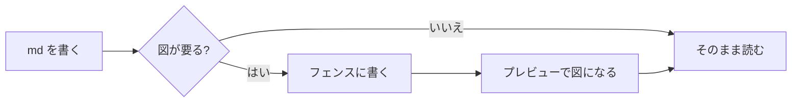
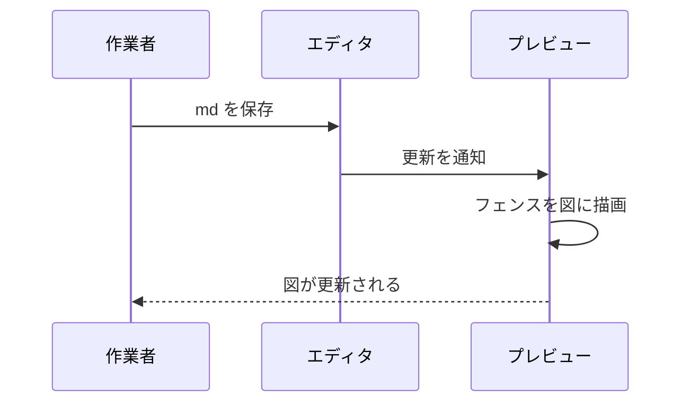

# md-preview-kit サンプル — この環境で書けるもの全部

このファイル1枚が **サンプルと仕様書の両方**を兼ねている。
対応したプレビューで開くと、以下のコードブロックがすべて図になる。

**Markdown を書いたことがない人**は、左に**このファイルのソース**、右に**プレビュー**を
並べて見るとよい（VS Code ならこの md を開いて `Ctrl+Shift+V`、または
`Ctrl+K` → `V` で横に並ぶ）。「こう書くとこう出る」がそのまま分かる。

**AI に書かせたい人**は、このファイルを読ませて
「この環境で使える書式で書いて」と言えばよい。使えるもの・使えないもの・
制約がすべてこの1枚に書いてある。

---

## 0. 何が使えるか（早見表）

| 書くもの | 書き方 | 表示できるか |
|---|---|---|
| 基本の Markdown | 標準記法（§1） | ✓ VS Code の標準機能 |
| タイミング図 | ` ```wavedrom ` フェンス | ✓ **md-preview-kit** |
| グラフ | ` ```chart ` フェンス | ✓ **md-preview-kit** |
| ラダー図（KV ニーモニック） | ` ```kvlist ` フェンス | ✓ **md-preview-kit** |
| フローチャート・シーケンス図など | ` ```mermaid ` フェンス | 追加の拡張が必要（§14） |
| 作図（draw.io） | `` | ✓ 画像として表示（編集は追加の拡張） |
| 回路図（schemdraw） | `` | ✓ 画像として表示 |
| 数式 | `$...$` / `$$...$$` | ✓ VS Code の標準機能 |

- 図の描画はすべて**プレビューの中の JavaScript** で走る。サーバも変換コマンドも
  要らないので、オフラインでも動く。
- md ファイルは**普通の Markdown のまま**。この環境が無い人が開いても、図の部分が
  文字として見えるだけで、文章は普通に読める。

---

# 第1部: Markdown の基本

> 📖 **Markdown そのもののドキュメント**
> ・[10分で分かるチュートリアル（CommonMark）](https://commonmark.org/help/tutorial/)
> ・[記法早見表](https://commonmark.org/help/)
> ・[GitHub Flavored Markdown 仕様](https://github.github.com/gfm/)（表・チェックリスト・打ち消しはこの拡張）
> ・[VS Code の Markdown 機能](https://code.visualstudio.com/docs/languages/markdown)

## 1. 見出し

`#` の数が見出しレベル。`#` の後に半角スペースが必要。

````markdown
# 大見出し
## 中見出し
### 小見出し
````

## 2. 段落と改行（最初に引っかかるところ）

**空行で区切ると段落**になる。逆に、**ただ改行しただけでは改行されない**。

この行と
この行は、ソースでは改行しているが、プレビューでは**つながって1行**になる。

改行したい場合は、行末に**半角スペース2個**を置くか、`<br>` と書く。

この行の末尾にはスペース2個がある  
なのでここで改行される。

## 3. 強調・打ち消し・コード

| 書き方 | 結果 |
|---|---|
| `*斜体*` または `_斜体_` | *斜体* |
| `**太字**` | **太字** |
| `***太字斜体***` | ***太字斜体*** |
| `~~打ち消し~~` | ~~打ち消し~~ |
| <code>\`インラインコード\`</code> | `インラインコード` |

## 4. リスト

箇条書きは `-`（`*` でもよい）。**行頭にスペース2個以上**でネストする。

- 第1階層
  - 第2階層
    - 第3階層
- 番号が要るなら数字

番号付きは `1.` `2.` … と書く（実際の番号はプレビューが振り直すので、
全部 `1.` と書いても順番に出る）。

1. 手順その1
2. 手順その2
   1. 入れ子の手順
3. 手順その3

チェックリスト（`- [ ]` と `- [x]`）:

- [x] 完了したタスク
- [ ] まだのタスク
- [ ] もう1つ

## 5. 引用・水平線

`>` で引用。

> 引用文。複数行に渡ってもよい。
>
> > 入れ子の引用。

`---` を単独行に書くと水平線（このファイルの区切り線もそれ）。

---

## 6. コードブロック

バッククォート3つで囲む。開始行に言語名を書くと**色分け**される。

```python
def hello(name: str) -> str:
    return f"Hello, {name}"
```

```sh
# シェルの例
ls -la | grep '\.md$'
```

**この「言語名」の仕組みを使って図を描くのが md-preview-kit** （第2部）。
`wavedrom` / `chart` / `kvlist` という言語名を書くと、色分けの代わりに図になる。

## 7. リンクと画像

| 書き方 | 意味 |
|---|---|
| `[表示文字](https://example.com)` | リンク |
| `<https://example.com>` | URL をそのまま出す |
| `` | 画像（`!` が付くと画像） |
| `` | 相対パスは**この md ファイルからの相対** |

例: [GitHub のリポジトリ](https://github.com/totochi-2022/md-preview-kit)

## 8. 表

`|` で区切り、2行目の `---` が区切り線。`:` で寄せを指定できる。

| 左寄せ | 中央寄せ | 右寄せ |
|:---|:---:|---:|
| abc | abc | abc |
| 長い項目名がここに入る | ✓ | 1,234 |
| a | - | 56 |

セル内の縦棒は `\|` と書く。セルの中では改行できない（`<br>` を使う）。

## 9. 数式

インラインは `$...$`、独立行は `$$...$$`（KaTeX 記法）。

抵抗 $R_1$ と容量 $C_1$ のローパスフィルタのカットオフ周波数は $f_c = 1/(2\pi R C)$。

$$
V_{out}(s) = \frac{1}{1 + sRC} \, V_{in}(s)
$$

> 📖 使える関数・記号の一覧: [KaTeX Supported Functions](https://katex.org/docs/supported.html)

## 10. HTML と、md に出したくない書き込み

md には HTML を直接書ける（`<br>` `<kbd>` `<details>` など）。

<details>
<summary>クリックで開く折りたたみ（クリックしてみる）</summary>

折りたたみの中身。長い補足や生ログを畳んでおくのに便利。

</details>

キー表記は <kbd>Ctrl</kbd> + <kbd>Shift</kbd> + <kbd>V</kbd> のように書ける。

**プレビューに出したくないメモ**は HTML コメントに入れる。

<!-- これはコメント。プレビューには出ない。 -->

---

# 第2部: 図を描く（md-preview-kit の本体）

コードブロックの言語名に `wavedrom` / `chart` / `kvlist` を指定すると、
中身を**図として描画**する。**中身は設定データ（JSON5）**で、プログラムではない。

## 11. タイミング図（`wavedrom`）

````markdown
```wavedrom
{ signal: [
  { name: "clk", wave: "p......." }
]}
```
````

と書くと:

```wavedrom
{ signal: [
  { name: "clk",  wave: "p......." },
  { name: "req",  wave: "0.1..0.." },
  { name: "ack",  wave: "0..1..0." },
  { name: "data", wave: "x.=.=.x.", data: ["D0", "D1"] }
],
  head: { text: "handshake" }
}
```

`wave` の1文字が1クロック。主な文字:

| 文字 | 意味 |
|---|---|
| `p` / `n` | クロック（立ち上がり／立ち下がり） |
| `0` / `1` | Low / High で固定 |
| `.` | 直前の状態を継続 |
| `x` | 不定 |
| `=` | データ（`data:` の文字列を順に入れる） |
| `2` `3` `4`… | 色違いのデータ |

バス・グループ・区切りの例（`{}` だけの行は空きスペース）:

```wavedrom
{ signal: [
  { name: "clk", wave: "P........" },
  {},
  { name: "bus", wave: "x.==.=x..", data: ["addr", "data", "data"] },
  { name: "we",  wave: "0.1...0.." }
]}
```

> 📖 **WaveDrom のドキュメント**
> ・[チュートリアル（`wave` の文字・記法の全体像）](https://wavedrom.com/tutorial.html)
> ・[WaveJSON の仕様（signal / head / config などのキー一覧）](https://github.com/wavedrom/wavedrom/wiki/WaveJSON)
> ・[本家サイトのエディタ（書いてすぐ試せる）](https://wavedrom.com/)

## 12. グラフ（`chart`）

Chart.js の設定をそのまま書く（`type` と `data` が必須）。

```chart
{ type: "bar",
  data: {
    labels: ["Mon","Tue","Wed","Thu","Fri"],
    datasets: [{ label: "処理数", data: [12, 19, 7, 15, 9] }]
  },
  options: { plugins: { title: { display: true, text: "週次処理数" } } }
}
```

折れ線・複数系列:

```chart
{ type: "line",
  data: {
    labels: ["0","1","2","3","4","5"],
    datasets: [
      { label: "A", data: [1,3,2,5,4,6], tension: 0.3 },
      { label: "B", data: [2,2,3,3,4,4], tension: 0.3 }
    ]
  }
}
```

円グラフ:

```chart
{ type: "doughnut",
  data: {
    labels: ["OK","再検査","NG"],
    datasets: [{ data: [82, 12, 6] }]
  },
  options: { plugins: { legend: { position: "right" } } }
}
```

`type` は `bar` / `line` / `pie` / `doughnut` / `radar` / `scatter` / `bubble` などが使える。

> **制約**: 設定に**関数は書けない**（`callback: function(){...}` の類）。
> プレビューの実行環境がコード評価を禁じているため、原理的な制約であり仕様。
> 目盛りの整形などは、関数を使わない設定項目で書くか、あらかじめ整形した値を渡す。

> 📖 **Chart.js のドキュメント**（この `chart` フェンスの中身は Chart.js の設定そのもの）
> ・[グラフ種類ごとの書き方](https://www.chartjs.org/docs/latest/charts/)（bar / line / pie / radar / scatter …）
> ・[設定項目（options）](https://www.chartjs.org/docs/latest/general/options.html)
> ・[サンプル集（設定をそのまま真似られる）](https://www.chartjs.org/docs/latest/samples/)
> ・[ドキュメント全体](https://www.chartjs.org/docs/latest/)
> ※ サンプル中に関数（`callback: ...`）が出てきたら、それはここでは使えません（§19）

## 13. ラダー図（`kvlist`）

KV ニーモニック（キーエンス PLC のリスト形式）をラダー図として描画する。
図中の**同じデバイスにマウスを乗せると、全出現箇所が相互にハイライトされる**。

```kvlist
DEVICE:53
;MODULE:bbbb
;MODULE_TYPE:0
;SCRIPT_TYPE:
LD MR3013
OUT MR2013
;MR3012 = 1
;MR3012 = 1
LD MR3013
AND MR3014
SET MR1000
NCJ #1000
;MR3012 = 1
LD CR2002
OUT MR3012
LABEL #1000
;
;MR3012 = 0
;MR3012 = 0
LD MR3013
ANB MR3014
SET MR1000
NCJ #1001
;MR3012 = 0
LD CR2003
OUT MR3012
LABEL #1001
;
LD MR3014
@SMOV "H:1" DM8000
END
ENDH
```

> 📖 描画の実装とニーモニックの対応: [totochi-2022/ladder_viewer](https://github.com/totochi-2022/ladder_viewer)

## 14. フローチャート・シーケンス図（`mermaid`）

`mermaid` は md-preview-kit ではなく、**VS Code の追加拡張が描画する**。

拡張 **Markdown Preview Mermaid Support** を入れると描けるようになる
（`install.bat` で「関連する拡張も入れますか？」に `y` と答えた場合は既に入っている）。





上の2つが図になっていなければ、mermaid が有効になっていない
（VS Code なら上記の拡張を入れる）。

> 📖 **mermaid のドキュメント**
> ・[記法（フローチャート・シーケンス図・ガント・ER 図など）](https://mermaid.js.org/syntax/flowchart.html)
> ・[ドキュメント全体](https://mermaid.js.org/intro/)
> ・VS Code 拡張: [Markdown Preview Mermaid Support](https://marketplace.visualstudio.com/items?itemName=bierner.markdown-mermaid)

---

# 第3部: 図を画像として貼る

フェンス描画とは別に、**SVG ファイルを画像として貼る**方法がある。
プレビュー側は「ただの画像」として扱うので、**どのホストでも確実に表示される**。

## 15. 作図ツールの図（draw.io）

`.drawio.svg` は**普通の SVG 画像**なので `` で貼れば表示される（グルー不要）。
draw.io は編集情報を SVG の中に埋め込むので、**表示しつつ再編集もできる**
（同じファイルを VS Code の Draw.io Integration 拡張／デスクトップ版 draw.io の
どちらでも開ける）。


> 📖 **draw.io**
> ・[ブラウザ版（インストール不要でここで作図できる）](https://app.diagrams.net/)
> ・[本家サイト（デスクトップ版のダウンロード・使い方）](https://www.drawio.com/)
> ・VS Code 拡張: [Draw.io Integration](https://marketplace.visualstudio.com/items?itemName=hediet.vscode-drawio)
> ※ 保存形式は **`.drawio.svg`**（「編集可能な SVG」）にすること。`.drawio` のままでは画像として貼れません

## 16. 回路図（schemdraw）

`.fig.svg` も同じくただの SVG 画像。こちらは Python（schemdraw）で描いたもので、
**生成に使ったソースが SVG の中に埋め込まれている**ため、後から編集して再生成できる。


> **重要**: プレビューは**この Python を実行しない**。表示しているのは
> 生成済みの SVG 画像だけ。md-preview-kit は**コードを一切実行しない**方針で、
> 図の生成は作った人の手元で完結している。
> （中身を見たい場合は `.fig.svg` をテキストエディタで開くと、先頭付近の
> `<metadata id="diagram-source">` にソースが入っている）

> 📖 **schemdraw のドキュメント**（図を自分で描き足すとき）
> ・[素子の一覧（抵抗・コンデンサ・IC・ロジックなど）](https://schemdraw.readthedocs.io/en/latest/elements/elements.html)
> ・[ドキュメント全体](https://schemdraw.readthedocs.io/en/latest/)

## 17. 画像全般の書き方

| 用途 | 書き方 |
|---|---|
| そのまま貼る | `` |
| 代替文字を付ける | `` |
| サイズを指定したい | ``（HTML で書く） |
| 中央に寄せたい | `<p align="center"></p>` |

パスは**その md ファイルからの相対**。フォルダを移動するときは画像も一緒に運ぶ。

---

# 第4部: 動作確認と制約

## 18. エラーの出方

フェンスの中身が壊れていると、**その場に赤いエラーが出る**だけで、
ページ全体は壊れない。どのフェンスが悪いかがすぐ分かる。

```wavedrom
{ signal: [ { name: "broken", wave: }
```

↑ ここに赤いエラーメッセージが出ていれば正常な動作。

## 19. 書けないもの・制約

| 制約 | 理由 |
|---|---|
| フェンスの設定に**関数を書けない** | プレビューはコード評価を禁じている（CSP）。仕様 |
| **プレビューがコードを実行することはない** | 配布される md を安全に開くための設計方針 |
| mermaid は**ホスト任せ** | VS Code では別拡張が必要（§14） |
| 画像の相対パスは**md ファイル基準** | md だけコピーすると画像が切れる |
| VS Code で **WSL 上の md を `\\wsl.localhost\...` で開くと自動更新されない** | VS Code のファイル監視の制約。ローカル（`C:\`）に置けば問題ない |

## 20. ドキュメント一覧（まとめ）

各フェンスの書式は、元ライブラリのドキュメントがそのまま使える。

| 対象 | ドキュメント |
|---|---|
| Markdown 記法 | [入門](https://commonmark.org/help/tutorial/) / [早見表](https://commonmark.org/help/) / [GFM 仕様](https://github.github.com/gfm/) |
| `wavedrom` | [チュートリアル](https://wavedrom.com/tutorial.html) / [WaveJSON 仕様](https://github.com/wavedrom/wavedrom/wiki/WaveJSON) / [オンラインエディタ](https://wavedrom.com/) |
| `chart` | [グラフ種類](https://www.chartjs.org/docs/latest/charts/) / [設定項目](https://www.chartjs.org/docs/latest/general/options.html) / [サンプル集](https://www.chartjs.org/docs/latest/samples/) |
| `kvlist` | [ladder_viewer](https://github.com/totochi-2022/ladder_viewer) |
| `mermaid` | [記法](https://mermaid.js.org/syntax/flowchart.html) / [全体](https://mermaid.js.org/intro/) / [VS Code 拡張](https://marketplace.visualstudio.com/items?itemName=bierner.markdown-mermaid) |
| draw.io | [ブラウザ版](https://app.diagrams.net/) / [本家](https://www.drawio.com/) / [VS Code 拡張](https://marketplace.visualstudio.com/items?itemName=hediet.vscode-drawio) |
| 回路図(schemdraw) | [素子一覧](https://schemdraw.readthedocs.io/en/latest/elements/elements.html) / [全体](https://schemdraw.readthedocs.io/en/latest/) |
| 数式(KaTeX) | [使える関数の一覧](https://katex.org/docs/supported.html) |
| フェンスの記法(JSON5) | [json5.org](https://json5.org/) |
| この環境そのもの | [md-preview-kit](https://github.com/totochi-2022/md-preview-kit) / [VS Code の Markdown 機能](https://code.visualstudio.com/docs/languages/markdown) |

設定は JSON5 で書けるので、**キーのクォートは省略でき、末尾カンマも許され、
`//` コメントも書ける**（素の JSON より緩い）。

```chart
{
  // コメントも書ける
  type: "bar",          // キーはクォート不要
  data: {
    labels: ["A", "B"],
    datasets: [{ data: [3, 5] }],   // 末尾カンマも許される
  },
}
```
